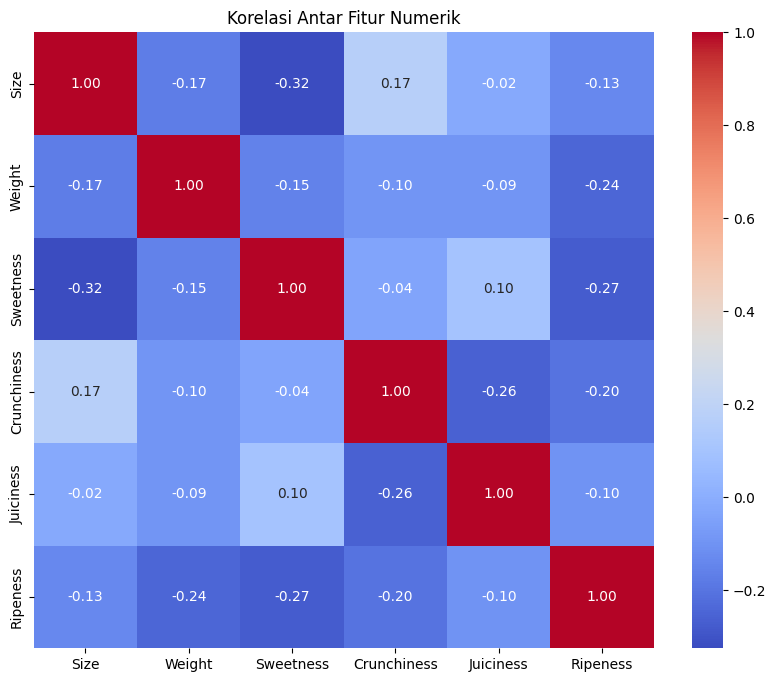
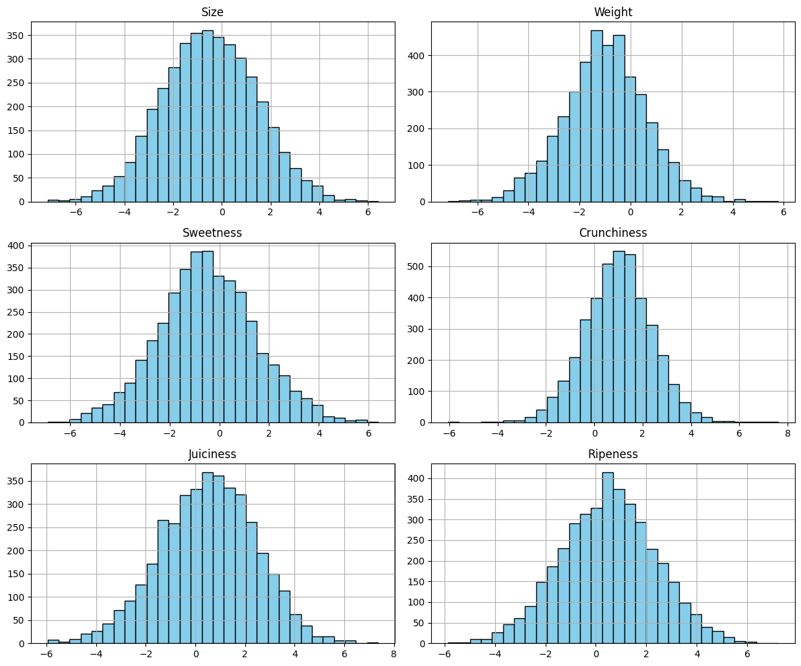
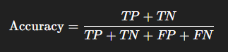
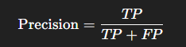
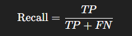
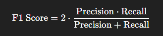

# Laporan Proyek Machine Learning (Predictive-Analytics) - Zidan Muhammad Ikvan

## Domain Proyek

Buah apel merupakan salah satu komoditas pertanian yang memiliki nilai ekonomi tinggi dan banyak dikonsumsi secara global. Kualitas apel memainkan peran penting dalam menentukan daya jual, kepuasan konsumen, dan efisiensi distribusi. Proses penilaian kualitas apel umumnya masih dilakukan secara manual oleh petani atau pekerja pertanian, yang seringkali bersifat subjektif dan tidak konsisten. Hal ini dapat menyebabkan kesalahan dalam klasifikasi mutu, penurunan harga jual, serta meningkatnya risiko penolakan produk oleh pasar.

Dengan kemajuan teknologi dalam bidang machine learning, proses klasifikasi kualitas apel dapat diotomatisasi berdasarkan parameter-parameter fisik dan sensorik seperti ukuran, berat, tingkat kemanisan, kerenyahan, kadar air (juiciness), dan tingkat kematangan. Pendekatan ini memungkinkan prediksi kualitas buah secara lebih objektif dan konsisten, sekaligus meningkatkan efisiensi dalam rantai pasok pertanian. Oleh karena itu, penelitian ini bertujuan untuk membangun model klasifikasi kualitas apel menggunakan data numerik sebagai fitur prediktif, dengan memanfaatkan algoritma pembelajaran mesin.

Melalui pendekatan ini, diharapkan sistem prediksi kualitas apel dapat membantu pelaku industri agrikultur dalam proses pemilahan otomatis, mengurangi ketergantungan terhadap inspeksi manual, serta meningkatkan nilai tambah pada produk pertanian.

## Business Understanding

Pada bagian ini, dijelaskan proses klarifikasi masalah yang menjadi dasar dari proyek analisis prediktif ini. Fokus proyek ini adalah pada pengklasifikasian kualitas apel berdasarkan atribut fisik dan kimianya menggunakan pendekatan machine learning, untuk mendukung pengambilan keputusan dalam rantai pasok pertanian atau industri buah.

### Problem Statements

Menjelaskan pernyataan masalah latar belakang:
1. Industri pertanian dan distribusi buah sering menghadapi kendala dalam mengklasifikasikan kualitas buah secara cepat dan akurat, terutama ketika volume panen tinggi. Proses manual (berbasis visual atau pengalaman) cenderung subjektif, tidak konsisten, dan memakan waktu.
2. Ketidaktepatan dalam klasifikasi kualitas buah dapat menyebabkan kerugian finansial, seperti buah berkualitas buruk masuk ke pasar premium atau sebaliknya, yang mengganggu rantai pasok dan memengaruhi kepuasan pelanggan.

### Goals

Menjelaskan tujuan dari pernyataan masalah:
1. Mengembangkan model klasifikasi berbasis machine learning (Random Forest) yang mampu mengklasifikasikan kualitas apel secara otomatis berdasarkan atribut seperti berat, ukuran, dan komposisi kimia, sehingga proses seleksi dapat dilakukan lebih cepat dan akurat.
2. Meningkatkan efisiensi rantai pasok dengan menyediakan sistem klasifikasi kualitas apel yang objektif dan dapat diandalkan, untuk meminimalkan kerugian akibat salah klasifikasi dan menjaga standar kualitas produk di pasar.

## Data Understanding
Dataset ini disediakan dengan murah hati oleh sebuah perusahaan pertanian Amerika. Dataset ini berisi informasi tentang berbagai atribut dari sekumpulan buah apel, yang memberikan wawasan tentang karakteristiknya. Dataset ini memiliki 4.001 sampel buah apel dengan berbagai karakteristik dan kualitas. Karakteristik yang dimaksud di sini meliputi fitur numerik seperti Size, Weight, Sweetness, Crunchiness, Juiciness, Ripeness, dan Acidity, serta fitur non-numerik seperti Quality. Kedelapan fitur ini akan digunakan untuk menemukan pola pada data, sedangkan Quality merupakan fitur target yang menunjukkan kelas kualitas buah apel. Kualitas apel dalam dataset ini terbagi menjadi dua kategori: good (baik) dan bad (buruk)". Oh iya, dataset ini tersedia secara publik melalui platform Kaggle:
[Apple Quality Dataset - Kaggle](https://www.kaggle.com/datasets/nelgiriyewithana/apple-quality)

1. A_id: Pengenal unik untuk setiap buah
2. Size: Ukuran buah
3. Weight: Berat buah
4. Sweetness: Tingkat kemanisan buah
5. Crunchinesss: Tekstur yang menunjukkan kerenyahan buah
6. Juiciness: Tingkat kesegaran buah
7. Ripeness: Tahap kematangan buah
8. Acidity: Tingkat keasaman buah
9. Quality: Kualitas buah secara keseluruhan (Target)

### Tahapan Exploratory Data Analysis (EDA)
Untuk memahami data lebih dalam, beberapa langkah eksplorasi dilakukan, di antaranya:

- Mendeteksi outlier yang dapat memengaruhi performa model

- Mengidentifikasi missing values/duplikat yang perlu diimputasi atau dihapus

- Menganalisis distribusi data untuk memahami penyebaran dan skewness tiap fitur

- Menemukan korelasi antar fitur yang mungkin berpengaruh pada prediksi

- Memahami karakteristik label target, termasuk class imbalance pada kasus klasifikasi

### Informasi Dataset
```
<class 'pandas.core.frame.DataFrame'>
RangeIndex: 4001 entries, 0 to 4000
Data columns (total 9 columns):
 #   Column       Non-Null Count  Dtype  
---  ------       --------------  -----  
 0   A_id         4000 non-null   float64
 1   Size         4000 non-null   float64
 2   Weight       4000 non-null   float64
 3   Sweetness    4000 non-null   float64
 4   Crunchiness  4000 non-null   float64
 5   Juiciness    4000 non-null   float64
 6   Ripeness     4000 non-null   float64
 7   Acidity      4001 non-null   object
 8   Quality      4000 non-null   object
dtypes: float64(7), object(2)
memory usage: 281.4+ KB
```
Dataset ini terdiri dari 4001 entri dan 9 kolom. Hampir semua kolom memiliki 1 nilai yang hilang (4000 non-null), kecuali kolom Acidity yang lengkap (4001 non-null). Mayoritas kolom (7 kolom) bertipe float64, sementara 2 kolom terakhir (Acidity dan Quality) bertipe object.

### Mengidentifikasi missing values/duplikat yang perlu diimputasi atau dihapus
```python
# Cek jumlah data hilang (null)
print("\nJumlah Missing Value per Kolom:")
print(df.isnull().sum())
```
```bash
Jumlah Missing Value per Kolom:
A_id           1
Size           1
Weight         1
Sweetness      1
Crunchiness    1
Juiciness      1
Ripeness       1
Acidity        0
Quality        1
dtype: int64
```
```python
# Menghapus missing values
df = df.dropna()
```
```python
# Cek duplikasi data
print("\nJumlah data duplikat:")
print(df.duplicated().sum())
```
```bash
Jumlah data duplikat:
0
```

### Describe Dataset
```
	A_id	Size	Weight	Sweetness	Crunchiness	Juiciness	Ripeness
count	4000.000000	4000.000000	4000.000000	4000.000000	4000.000000	4000.000000	4000.000000
mean	1999.500000	-0.503015	-0.989547	-0.470479	0.985478	0.512118	0.498277
std	1154.844867	1.928059	1.602507	1.943441	1.402757	1.930286	1.874427
min	0.000000	-7.151703	-7.149848	-6.894485	-6.055058	-5.961897	-5.864599
25%	999.750000	-1.816765	-2.011770	-1.738425	0.062764	-0.801286	-0.771677
50%	1999.500000	-0.513703	-0.984736	-0.504758	0.998249	0.534219	0.503445
75%	2999.250000	0.805526	0.030976	0.801922	1.894234	1.835976	1.766212
max	3999.000000	6.406367	5.790714	6.374916	7.619852	7.364403	7.237837

```
Tabel statistik deskriptif memberikan gambaran mengenai distribusi fitur numerik dalam dataset. Beberapa informasi yang menarik dari statistik deskriptif ini adalah:
- Distribusi mean ≈ 0 dan standar deviasi wajar menunjukkan kemungkinan data telah standardized atau di-scale, yang bagus untuk model ML.
- Tidak ada nilai kosong atau aneh yang tampak.

### Menghitung korelasi dan Visualisasi dengan heatmap

- Size dan Sweetness: -0.32. Ini menunjukkan korelasi negatif yang moderat. Artinya, ada kecenderungan bahwa semakin besar ukurannya (Size), semakin rendah tingkat kemanisannya (Sweetness), dan sebaliknya.
- Size dan Crunchiness: 0.17. Ini menunjukkan korelasi positif yang lemah. Ada sedikit kecenderungan bahwa semakin besar ukurannya, semakin tinggi tingkat kerenyahannya (Crunchiness).
- Sweetness dan Ripeness: -0.27. Ini menunjukkan korelasi negatif yang moderat. Semakin tinggi tingkat kemanisan, cenderung semakin rendah tingkat kematangan (Ripeness), atau sebaliknya (berdasarkan data ini).
- Juiciness dan Size: -0.02. Korelasi sangat lemah, mendekati nol. Hampir tidak ada hubungan linear antara tingkat kadar air (Juiciness) dan ukuran (Size).
- Crunchiness dan Juiciness: -0.26. Korelasi negatif moderat. Semakin renyah (Crunchiness), cenderung semakin rendah kadar airnya (Juiciness).

### Plot histogram untuk masing-masing fitur

- Semua enam fitur ('Size', 'Weight', 'Sweetness', 'Crunchiness', 'Juiciness', 'Ripeness') menunjukkan distribusi yang tampak mirip kurva normal atau berbentuk lonceng (bell-shaped). Ini berarti sebagian besar nilai terkonsentrasi di sekitar nilai tengah, dan frekuensinya menurun secara simetris ke kedua sisi.

## Data Preparation
Pada tahap ini dilakukan serangkaian proses untuk mempersiapkan data sebelum masuk ke tahap pemodelan. Proses ini bertujuan untuk memastikan bahwa data dalam kondisi optimal untuk dilatih oleh algoritma machine learning, sehingga menghasilkan model yang akurat dan dapat diandalkan.

### Mengubah type data
```python
# Ubah 'Acidity' jadi float
df['Acidity'] = df['Acidity'].astype(float)

# Ubah 'Quality' jadi 0/1 | 0 = bad, 1 = good
df['Quality'] = df['Quality'].map({'bad': 0, 'good': 1})

```
Penjelasan:
- Kolom Acidity dikonversi ke tipe data float agar dapat diproses dalam perhitungan numerik dan analisis statistik oleh model.

- Kolom Quality yang semula bertipe kategorikal ('good' / 'bad') diubah menjadi numerik biner (0 dan 1) untuk mendukung proses klasifikasi supervised learning.

Alasan:
Sebagian besar algoritma machine learning memerlukan input berupa numerik. Oleh karena itu, data bertipe kategorikal harus dikonversi ke bentuk numerik agar bisa digunakan dalam pemodelan.

### Pemisahan fitur dan target
```python
# Pemisahan Fitur dan Target
X = df.drop(columns=['A_id', 'Quality'])
y = df['Quality']

```
Penjelasan:
- Memisahkan fitur (X) dan target (y) dari dataset. Fitur berisi atribut-atribut yang digunakan untuk prediksi, sedangkan target berisi label kualitas apel yang ingin diprediksi.

- Kolom 'A_id' tidak digunakan karena hanya berfungsi sebagai identifier dan tidak relevan untuk prediksi.

Alasan:
Pemisahan ini adalah prosedur standar dalam supervised learning, untuk mempersiapkan data sebelum dibagi menjadi data latih dan data uji.
### Pembagian data
```python
# Pembagian Data: Train-Test Split 80:20
X_train, X_test, y_train, y_test = train_test_split(
    X, y, test_size=0.2, random_state=42, stratify=y)

```
Penjelasan:
- Data dibagi menjadi 80% untuk pelatihan (train) dan 20% untuk pengujian (test) menggunakan train_test_split dari Scikit-Learn.

- Parameter stratify=y digunakan untuk memastikan distribusi kelas (0 dan 1) tetap seimbang di data latih dan data uji.

Alasan:
Tujuannya agar model dapat dilatih dengan data yang cukup, dan diuji pada data yang tidak pernah dilihat sebelumnya. Stratifikasi penting dalam data klasifikasi untuk menghindari bias distribusi kelas.
### Standarisasi Fitur
```python
# Standarisasi Fitur Numerik (Scaling)
scaler = StandardScaler()
X_train_scaled = scaler.fit_transform(X_train)
X_test_scaled = scaler.transform(X_test)

```
Penjelasan:
- Melakukan standarisasi pada fitur numerik menggunakan StandardScaler, yang mengubah skala setiap fitur menjadi distribusi dengan rata-rata 0 dan standar deviasi 1.

- Proses ini dilakukan pada X_train, lalu transformasi yang sama diterapkan pada X_test.

Alasan:
Beberapa algoritma (meskipun Random Forest tidak terlalu sensitif terhadap skala) tetap mendapat manfaat dari fitur yang distandarisasi agar proses perbandingan antar atribut tidak bias. Ini juga menjadi kebiasaan yang baik untuk memastikan konsistensi pipeline jika algoritma lain digunakan di kemudian hari.
### Final Shape
```python
# Mengecek Final Shape dan Siap Modeling
print("X_train:", X_train_scaled.shape)
print("X_test:", X_test_scaled.shape)
print("y_train:", y_train.shape)
print("y_test:", y_test.shape)

```
Penjelasan:
- Menampilkan bentuk akhir dari dataset setelah semua proses data preparation untuk memastikan bahwa dimensi fitur dan target sesuai dan konsisten.

Alasan:
Pengecekan ini penting untuk memastikan bahwa semua tahapan data preparation berjalan dengan baik, dan tidak ada ketidaksesuaian dimensi yang bisa menyebabkan error saat pemodelan.

## Modelling
Tahapan ini berfokus pada penerapan algoritma machine learning untuk menyelesaikan permasalahan klasifikasi kualitas apel. Model yang digunakan adalah Random Forest Classifier, sebuah ensemble method berbasis pohon keputusan yang kuat dan sering digunakan dalam berbagai permasalahan klasifikasi karena kestabilan dan kemampuannya menangani data yang kompleks.

### Baseline Model
```python
# Random Forest
rf_model = RandomForestClassifier(random_state=42)
rf_model.fit(X_train_scaled, y_train)

```
Penjelasan:
- Model awal (baseline) dibuat menggunakan RandomForestClassifier tanpa pengaturan parameter secara spesifik, hanya dengan random_state=42 agar hasilnya dapat direproduksi.
- Model dilatih menggunakan data latih yang telah melalui proses standarisasi.

Kelebihan:
- Tidak mudah overfitting karena menggunakan kombinasi banyak pohon.

- Mampu menangani data dengan dimensi tinggi dan tidak memerlukan scaling (meskipun tetap digunakan di sini).

- Menyediakan feature importance.

Kekurangan:
- Lebih lambat dibandingkan model linear jika dataset sangat besar.

- Bisa menjadi kompleks dan sulit diinterpretasikan.

### Hyperparameter Tuning dengan GridSearchCV
```python
# Inisialisasi model dasar
rf_model = RandomForestClassifier(random_state=42)

# Daftar parameter yang akan diuji
param_grid = {
    'n_estimators': [150, 200],
    'max_depth': [15, 20],
    'min_samples_split': [5, 10],
    'min_samples_leaf': [3, 5],
    'max_features': ['sqrt', 'log2']
}

# GridSearch dengan 5-fold cross-validation
grid_search = GridSearchCV(estimator=rf_model, param_grid=param_grid, cv=5, n_jobs=-1, verbose=1)

# Fit model ke data training
grid_search.fit(X_train_scaled, y_train)

# Tampilkan parameter terbaik
print("Best Parameters:", grid_search.best_params_)

```
Penjelasan:
- Dilakukan pencarian kombinasi parameter terbaik menggunakan GridSearchCV, sebuah teknik brute-force yang mencoba semua kombinasi parameter dalam param_grid.

- Menggunakan 5-fold cross-validation untuk memastikan model tidak hanya bagus pada satu subset data.

- Parameter yang diuji:

    n_estimators: Jumlah pohon dalam hutan.

    max_depth: Kedalaman maksimum setiap pohon.

    min_samples_split: Minimum jumlah sampel yang dibutuhkan untuk membagi node.

    min_samples_leaf: Minimum jumlah sampel pada daun pohon.

    max_features: Jumlah fitur yang dipertimbangkan ketika membagi node.

Tujuan:
Meningkatkan performa model dan mengurangi overfitting dengan mencari kombinasi parameter yang optimal.

### Final Tuned Model
```python
# Random Forest dengan parameter terbaik dari GridSearchCV
rf_model_tuned = RandomForestClassifier(
    n_estimators=150,
    max_depth=20,
    min_samples_split=5,
    min_samples_leaf=3,
    max_features='sqrt',
    random_state=42
)  

# Latih model
rf_model_tuned.fit(X_train_scaled, y_train)

```
Penjelasan:
- Model akhir dibuat berdasarkan hasil parameter terbaik dari GridSearchCV.

- Diharapkan model ini memiliki generalisasi yang lebih baik dan tidak terlalu overfit seperti model awal.

**Proses Improvement**

Sebelum Tuning:
- Akurasi Train: 100%

- Akurasi Test: 88%

- Train Confusion Matrix:
Semua data pada train set diklasifikasi dengan benar tanpa kesalahan (TP & TN sempurna).

- Test Confusion Matrix:
Terdapat 64 false positives dan 34 false negatives, menunjukkan bahwa model tidak generalisasi dengan sempurna meskipun akurasi masih tinggi (88%).

- Kesimpulan: Model terlalu “menghapal” data latih, sehingga performanya pada data uji lebih rendah dari yang seharusnya.

Setelah Tuning:
- Akurasi Train: Turun menjadi 98%

- Akurasi Test: Turun tipis menjadi 87%

- Train Confusion Matrix:
Terdapat 30 false positives dan 24 false negatives, yang menandakan model kini membuat sedikit kesalahan pada data latih.

- Test Confusion Matrix:
Jumlah kesalahan sedikit berubah (67 FP, 39 FN), dan performa test set tetap baik.

- Kesimpulan: Setelah tuning, model menjadi lebih realistis dan generalisasi lebih baik karena tidak lagi menunjukkan performa sempurna pada data latih. Hal ini mengindikasikan penurunan overfitting.

Parameter Tuning yang Mempengaruhi:
- max_depth=20 membatasi kedalaman pohon agar tidak terlalu kompleks.

- min_samples_split=5 dan min_samples_leaf=3 membatasi pemecahan node untuk mencegah pohon tumbuh berlebihan.

- max_features='sqrt' membantu mengurangi korelasi antar pohon di ensemble.

## Evaluation

### Metrik Evaluasi yang Digunakan:

1. Accuracy
  
  Mengukur proporsi prediksi yang benar terhadap seluruh data. Cocok sebagai metrik umum ketika distribusi kelas tidak terlalu timpang.
2. Precision
  
  Mengukur seberapa akurat prediksi positif yang dibuat oleh model. Cocok saat false positive memiliki dampak besar, misalnya ketika mengklasifikasikan apel jelek sebagai "good".
3. Recall
  
  Mengukur seberapa banyak data positif yang berhasil ditangkap oleh model. Cocok saat false negative harus diminimalkan, misalnya agar tidak melewatkan apel bagus yang seharusnya disortir.
4. F1 Score
  
  Merupakan rata-rata harmonik dari precision dan recall, digunakan untuk menyeimbangkan keduanya. Cocok ketika kita membutuhkan trade-off antara precision dan recall.

### Hasil Evaluasi
**Sebelum Tuning:**
```bash
=== Random Forest (Train Data) ===
[[1597    0]
 [   0 1603]]
              precision    recall  f1-score   support

           0       1.00      1.00      1.00      1597
           1       1.00      1.00      1.00      1603

    accuracy                           1.00      3200
   macro avg       1.00      1.00      1.00      3200
weighted avg       1.00      1.00      1.00      3200

=== Random Forest (test) ===
[[335  64]
 [ 34 367]]
              precision    recall  f1-score   support

           0       0.91      0.84      0.87       399
           1       0.85      0.92      0.88       401

    accuracy                           0.88       800
   macro avg       0.88      0.88      0.88       800
weighted avg       0.88      0.88      0.88       800

```
Model menunjukkan overfitting karena hasil pelatihan sempurna (100%), sementara hasil pada data test lebih rendah. Precision dan recall masih cukup baik, tetapi gap antara train-test mengindikasikan kurangnya generalisasi.

**Setelah Tuning:**
```bash
[[1567   30]
 [  24 1579]]
              precision    recall  f1-score   support

           0       0.98      0.98      0.98      1597
           1       0.98      0.99      0.98      1603

    accuracy                           0.98      3200
   macro avg       0.98      0.98      0.98      3200
weighted avg       0.98      0.98      0.98      3200

=== Random Forest (Test Data, Tuned) ===
[[332  67]
 [ 39 362]]
              precision    recall  f1-score   support

           0       0.89      0.83      0.86       399
           1       0.84      0.90      0.87       401

    accuracy                           0.87       800
   macro avg       0.87      0.87      0.87       800
weighted avg       0.87      0.87      0.87       800
```
Setelah tuning, terjadi penurunan kecil pada akurasi (dari 88% → 87%), namun model menjadi lebih seimbang. Precision dan recall tetap berada pada kisaran tinggi, dengan F1-score yang stabil. Yang terpenting, akurasi pelatihan tidak lagi sempurna, menunjukkan bahwa model telah berkurang tingkat overfitting-nya dan lebih siap untuk digunakan pada data baru.

